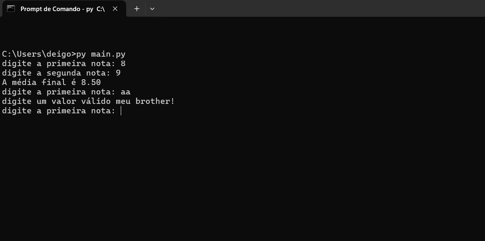

# Simples Programa de Média

Esse projetinho simples serve para calcular media em python.

## Código

```python
while True:
    try:
        primeira_nota = float(input("digite a primeira nota: "))
        segunda_nota = float(input("digite a segunda nota: "))

        media = (primeira_nota + segunda_nota) / 2

        print(f"a média final é {media:.2f}")
    except:
        print("ERRO; digite algo valido meu brother!")
```

